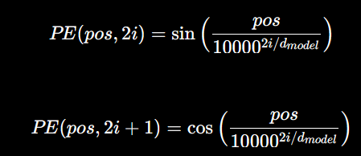
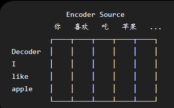

手撕 transformer 架构

预备工作：


一、分词

训练集、测试集、验证集
```
DatasetDict({
    train: Dataset({
        features: ['conversations'],
        num_rows: 340
    })
    validation: Dataset({
        features: ['conversations'],
        num_rows: 42
    })
    test: Dataset({
        features: ['conversations'],
        num_rows: 43
    })
})
```

实现分词器：tokenizer

<PAD>: 填充
<BOS>: 开始字符
<EOS>: 结束字符
<UNK>: 未知


构建数据集

source
target

padding mask  causual mask

二、embedding 词嵌入，向量化
位置编码



多头注意力机制
QKV
ffn + add + norm
前馈全连接层 + 残差连接 + 标准归一化 

一层 encoder 
多层叠加 N = 6

词嵌入 -> 位置编码 -> Norm -> 多头注意力 -> Add 残差 + Norm -> 前馈全连接 FFN -> Add 残差 + Norm -> Decoder


Decoder:
    掩码多头注意力
    交叉注意力
    

    掩码理解句子
    交叉寻找与源句中相关的

多层 Decoder 叠加


最终形态：
    把 Encoder 的 output 传给 Decoder
    